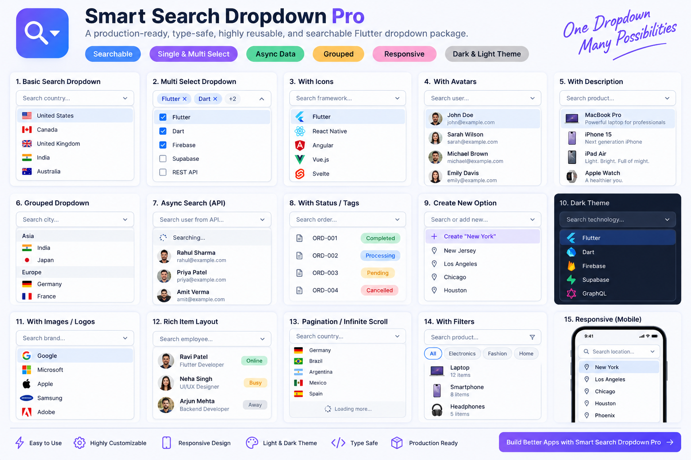

# Smart Search Dropdown Pro



[](https://pub.dev/packages/smart_search_dropdown_pro)
[](https://opensource.org/licenses/MIT)

A powerful, developer-first Flutter searchable dropdown library designed for enterprise applications, SaaS platforms, e-commerce, admin dashboards, finance, CRM, and mobile/web/desktop applications.

---

## Key Features

- ⚡ **Dual-Level API Architecture**: Use direct Level 1 boolean flags for clean 5-line setups or Level 2 configuration objects for deep customization.
- 🔍 **Async API Search with Race-Condition Protection**: Built-in debouncing, request generation tokens, loading/error states, and item deduplication.
- 📦 **Infinite Scroll Pagination**: Native paged loading support for large remote datasets.
- 🏷️ **Multi-Select & Custom Chips**: Tri-state header checkboxes (`Select All` / `Clear All`), overflow counters (`+N more`), and custom chip UI builders.
- 🎨 **TextFormField & InputDecoration Compatible**: Native Flutter Form validation, `autovalidateMode`, and custom decoration styling.
- 📁 **Categorized Grouping**: Group items into sticky headers using custom category extractors.
- 📱 **Adaptive Responsive Engine**: Auto-switch between desktop popups, dialogs, and mobile bottom sheets seamlessly.

---

## 🚀 Quick Start

### 1. Simple Single Selection (Level 1 API)

```dart
SmartSearchDropdown<Product>(
  labelText: 'Product Catalog *',
  hintText: 'Search products...',
  items: products,
  value: selectedProduct,
  onChanged: (product) {
    print('Selected product: ${product?.title}');
  },
  itemLabelBuilder: (p) => p.title,
  itemSubtitleBuilder: (p) => '${p.category} • \$${p.price}',
  itemIconBuilder: (p) => const Icon(Icons.shopping_bag_outlined),
  showSearch: true,
  showClearButton: true,
);
```

### 2. Multi-Select with Custom Chips

```dart
SmartSearchDropdown<Country>.multi(
  labelText: 'Target Operating Regions',
  hintText: 'Select countries...',
  items: countries,
  selectedItems: selectedCountries,
  onMultiChanged: (countries) {
    print('Selected ${countries.length} countries');
  },
  itemLabelBuilder: (c) => '${c.flag} ${c.name}',
  showSelectAll: true,
  showClearAll: true,
  showCheckbox: true,
);
```

---

## 📘 Detailed Feature Documentation

### 1. Dual-Level API Architecture

#### Overview & Purpose
Provides developers with two ways to configure the dropdown: Level 1 for rapid prototyping and clean UI code, and Level 2 for enterprise design systems needing centralized configuration objects.

#### When & Why to Use It
- **Level 1**: Ideal for 90% of use cases where you simply want to toggle search, clear button, or pagination with boolean flags directly on the widget.
- **Level 2**: Ideal when creating shared component wrappers or theme configurations across a large project.

#### Code Example
```dart
// Level 1: Clean Boolean Flags
SmartSearchDropdown<User>(
  items: users,
  itemLabelBuilder: (u) => u.name,
  showSearch: true,
  showClearButton: true,
  showScrollbar: true,
  enableAdaptive: true,
  onChanged: (user) {},
);

// Level 2: Advanced Configuration Objects
SmartSearchDropdown<User>(
  items: users,
  itemLabelBuilder: (u) => u.name,
  config: SmartDropdownConfig<User>(
    search: const SmartDropdownSearchConfig(
      enabled: true,
      debounceDuration: Duration(milliseconds: 200),
      searchMode: SearchMode.contains,
    ),
    popup: SmartDropdownPopupConfig(
      maxHeight: 300,
      elevation: 8.0,
      presentation: DropdownPresentation.adaptive,
    ),
  ),
  onChanged: (user) {},
);
```

---

### 2. Async Remote API Search with Race-Condition Protection

#### Overview & Purpose
Allows fetching dropdown items dynamically from a REST or GraphQL API based on user search input. Includes automatic request generation tokens to eliminate out-of-order response race conditions.

#### When & Why to Use It
Use whenever querying remote servers (e.g. database search, user directories, autocomplete APIs) where responses may arrive out of sequence.

#### Code Example
```dart
SmartSearchDropdown<Framework>(
  labelText: 'Tech Stack Framework',
  hintText: 'Type to search remote API...',
  debounceMs: 300,
  asyncSearch: (query) async {
    final response = await http.get(Uri.parse('https://api.example.com/search?q=$query'));
    final List data = jsonDecode(response.body);
    return data.map((json) => Framework.fromJson(json)).toList();
  },
  itemLabelBuilder: (f) => f.name,
  itemSubtitleBuilder: (f) => 'Language: ${f.language}',
  itemIdExtractor: (f) => f.id, // Deduplicates results by ID
  onChanged: (framework) {},
);
```

---

### 3. Infinite Scroll Pagination

#### Overview & Purpose
Loads large datasets in paged chunks as the user scrolls down the dropdown popup.

#### When & Why to Use It
Essential for datasets containing thousands of items (e.g., customer databases, product catalogs) to keep memory overhead low and rendering smooth.

#### Code Example
```dart
SmartSearchDropdown<Product>(
  labelText: 'Paginated Inventory',
  hintText: 'Scroll down to load next page',
  pageSize: 20,
  loader: (query, page) async {
    final result = await fetchProductPage(query: query, page: page, limit: 20);
    return DropdownPageResult(
      items: result.products,
      hasMore: result.hasMorePages,
    );
  },
  itemLabelBuilder: (p) => p.title,
  onChanged: (product) {},
);
```

---

### 4. Categorized Grouping

#### Overview & Purpose
Groups items into categorical sections with customizable group headers.

#### When & Why to Use It
Great for multi-category products, location menus by continent/state, or settings grouped by domain.

#### Code Example
```dart
SmartSearchDropdown<Product>(
  labelText: 'Categorized Store Catalog',
  items: products,
  groupBy: (p) => p.category,
  enableGrouping: true,
  groupHeaderBuilder: (context, categoryName) => Container(
    padding: const EdgeInsets.symmetric(horizontal: 16, vertical: 8),
    color: Colors.indigo.withOpacity(0.1),
    child: Text(categoryName, style: const TextStyle(fontWeight: FontWeight.bold, color: Colors.indigo)),
  ),
  itemLabelBuilder: (p) => p.title,
  onChanged: (product) {},
);
```

---

### 5. Flutter Form Integration (`SmartSearchDropdownFormField`)

#### Overview & Purpose
Wraps `SmartSearchDropdown` inside a standard Flutter `FormField<T>`, providing full compatibility with `FormState`, `validator`, `onSaved`, and `autovalidateMode`.

#### Code Example
```dart
final _formKey = GlobalKey<FormState>();

Form(
  key: _formKey,
  child: Column(
    children: [
      SmartSearchDropdownFormField<Country>(
        labelText: 'Shipping Country *',
        hintText: 'Select country',
        items: countries,
        itemLabelBuilder: (c) => c.name,
        validator: (value) => value == null ? 'Please select a shipping country' : null,
        onSaved: (value) => saveCountry(value),
      ),
      ElevatedButton(
        onPressed: () {
          if (_formKey.currentState!.validate()) {
            _formKey.currentState!.save();
          }
        },
        child: const Text('Submit Order'),
      ),
    ],
  ),
);
```

---

## 📊 Feature Comparison Matrix

| Feature | Standard DropdownButton | Generic 3rd-Party Packages | Smart Search Dropdown Pro |
| :--- | :---: | :---: | :---: |
| **Dual-Level API (Simple & Advanced)** | ❌ No | ❌ No | ✅ **Yes (Level 1 & Level 2)** |
| **Async Search Race Condition Protection** | ❌ No | ⚠️ Basic | ✅ **Yes (Session Tokens)** |
| **Item Deduplication (`itemIdExtractor`)** | ❌ No | ❌ No | ✅ **Yes** |
| **Infinite Scroll Pagination (`loader`)** | ❌ No | ❌ No | ✅ **Yes** |
| **Multi-Select & Dismissible Chips** | ❌ No | ⚠️ Partial | ✅ **Yes (Full Customization)** |
| **Categorized Sticky Group Headers** | ❌ No | ❌ No | ✅ **Yes** |
| **Adaptive Responsive Engine (Popup/Sheet)**| ❌ No | ❌ No | ✅ **Yes (Auto-switch)** |
| **Form Integration & InputDecoration** | ❌ Manual | ⚠️ Limited | ✅ **Native `FormField`** |
| **Programmatic Controller** | ❌ No | ⚠️ Basic | ✅ **Full Controller API** |

---

## 📖 API Reference Table

| Parameter | Type | Default | Description |
| :--- | :--- | :--- | :--- |
| `items` | `List<T>?` | `null` | Static item list to display in the dropdown. |
| `value` | `T?` | `null` | Currently selected item for single-selection mode. |
| `selectedItems` | `List<T>?` | `null` | Currently selected items for multi-selection mode. |
| `onChanged` | `ValueChanged<T?>?` | `null` | Callback fired when single selection changes. |
| `onMultiChanged` | `ValueChanged<List<T>>?` | `null` | Callback fired when multi-selection changes. |
| `asyncSearch` | `Future<List<T>> Function(String)?` | `null` | Async search callback for remote API queries. |
| `loader` | `Future<DropdownPageResult<T>> Function(String, int)?` | `null` | Paged data loader callback for infinite scroll. |
| `showSearch` | `bool?` | `true` | Toggles search field visibility inside the popup. |
| `showClearButton` | `bool?` | `true` | Displays clear button in trigger when item selected. |
| `showDropdownIcon` | `bool?` | `true` | Toggles dropdown arrow icon on the trigger box. |
| `showCheckbox` | `bool?` | `true` | Toggles checkboxes in multi-select popup tiles. |
| `showSelectAll` | `bool?` | `true` | Toggles `Select All` header option in multi-select mode. |
| `showClearAll` | `bool?` | `true` | Toggles `Clear All` header option in multi-select mode. |
| `enablePagination` | `bool?` | `false` | Enables infinite scroll pagination. |
| `enableGrouping` | `bool?` | `false` | Enables item grouping when `groupBy` is set. |
| `enableAdaptive` | `bool?` | `false` | Auto-switches between popup and mobile bottom sheet. |
| `itemLabelBuilder` | `String Function(T)?` | `item.toString()` | Extracts string label from item object. |
| `itemSubtitleBuilder` | `String? Function(T)?` | `null` | Builds tile subtitle description text. |
| `itemIconBuilder` | `Widget? Function(T)?` | `null` | Builds leading icon for item tile. |
| `itemAvatarBuilder` | `Widget? Function(T)?` | `null` | Builds leading circular avatar for item tile. |
| `itemLeadingBuilder` | `Widget? Function(T)?` | `null` | Custom leading builder for item tile. |
| `isItemDisabled` | `bool Function(T)?` | `null` | Callback to disable interaction on specific items. |
| `itemIdExtractor` | `Object Function(T)?` | `null` | Unique identifier extractor for item deduplication. |
| `itemEquality` | `bool Function(T, T)?` | `null` | Custom equality comparator function. |
| `searchFieldBuilder` | `Widget Function(BuildContext, ValueChanged<String>)?` | `null` | Custom builder for popup search text field. |
| `chipBuilder` | `Widget Function(BuildContext, T, VoidCallback)?` | `null` | Custom builder for selected chips in multi-select trigger. |
| `config` | `SmartDropdownConfig<T>?` | `null` | Master configuration object for Level 2 API. |
| `controller` | `SmartDropdownController<T>?` | `null` | External controller instance for programmatic control. |

---

## 📄 License

This package is released under the [MIT License](LICENSE).
